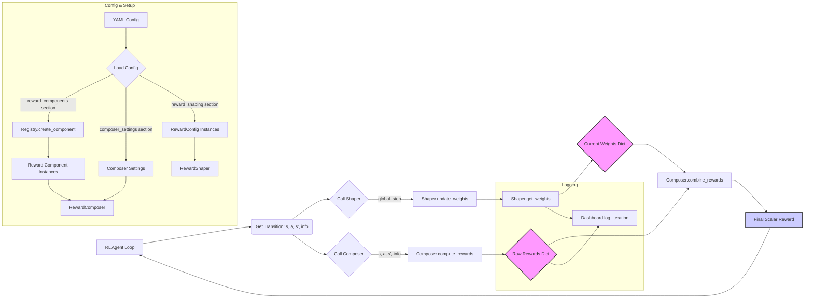

Okay, here is the complete markdown content for `/Users/cheencheen/Desktop/git/rl/RLlama/README.md` based on the layered structure we discussed:

```markdown:/Users/cheencheen/Desktop/git/rl/RLlama/README.md
# RLlama: Modular Reward Signal Engineering

*A framework for designing, composing, and modulating complex reward signals to guide Reinforcement Learning agents.*

---

## TL;DR: What is This and Why Should I Care?

*   **Problem:** Guiding an RL agent with a single, sparse reward signal is like trying to tune a complex system with just an on/off switch. It lacks nuance and can lead to painfully slow convergence or suboptimal behavior.
*   **Solution: Reward Shaping (Signal Engineering):** Craft a richer guidance signal! Blend multiple feedback sources: penalize inefficiency (like damping unwanted oscillations), reward progress towards sub-goals (like reinforcing desired frequencies), encourage exploration (injecting constructive noise).
*   **This Framework (Your Signal Toolkit):** Provides the components for sophisticated reward signal design:
    *   **Signal Generators (`BaseReward`):** Define individual reward components – your fundamental signal sources (e.g., goal proximity sine wave, energy usage step function).
    *   **Mixing Console (`RewardComposer`):** Combine these raw signals. Optionally normalize them (like gain control) to prevent clipping or unwanted dominance.
    *   **Dynamic Equalizer (`RewardShaper`):** Modulate the amplitude (weight) of each component signal over time using configurable schedules (like applying envelopes or LFOs).
    *   **Configuration Presets (YAML):** Define your entire signal chain declaratively, making it easy to experiment with different mixes.
    *   **Oscilloscope (`RewardDashboard`):** Visualize the contribution and modulation of each signal component throughout the training process.

**In short: If you want to move beyond basic reward pulses and engineer sophisticated, dynamic guidance signals for your RL agents, RLlama provides the modular toolkit.**

---

## Technical Deep Dive: Framework Architecture

For developers wanting to understand the internals, the framework is built around several core components designed for modularity and configurability:

1.  **`BaseReward` (in `rllama.rewards.base`)**:
    *   **Role:** Abstract base class for all individual reward components.
    *   **Interface:** Defines the essential contract: a `name` property (string identifier) and a `__call__` method that takes `(state, action, next_state, info)` and returns a `float` reward value for that specific component.
    *   **Design:** Enforces a consistent interface for all reward sources, making them interchangeable.

2.  **`RewardComposer` (in `rllama.rewards.composition`)**:
    *   **Role:** Orchestrates the calculation of raw rewards from multiple components and combines them.
    *   **Functionality:**
        *   Takes a list of `BaseReward` instances at initialization.
        *   `compute_rewards()`: Iterates through its components, calling each one to get their raw, unweighted reward values for the current transition. Returns a dictionary mapping component names to their raw values.
        *   `combine_rewards()`: Takes the raw reward dictionary and a dictionary of current weights (from the `RewardShaper`), performs element-wise multiplication, and sums the results to produce the final scalar reward for the agent.
        *   **Normalization (Optional):** Can maintain running statistics (mean/std dev) for each component's raw reward over a sliding window (`norm_window`). If enabled (`normalize=True`), it scales raw rewards before weighting and combination, helping to balance components with different magnitudes.
    *   **Design:** Separates the *calculation* of individual rewards from their *weighting and combination*.

3.  **`RewardConfig` (in `rllama.rewards.shaping`)**:
    *   **Role:** A data structure (typically a Pydantic model or dataclass) holding the configuration for *how* a single reward component's weight should behave over time.
    *   **Attributes:** Includes `name` (must match the component's `name`), `initial_weight`, `decay_schedule` (e.g., 'none', 'linear', 'exponential'), `decay_steps` or `decay_rate`, `min_weight`/`max_weight`, potentially `start_step`.
    *   **Design:** Encapsulates the dynamic behavior parameters for a single weight, making the shaping logic declarative.

4.  **`RewardShaper` (in `rllama.rewards.shaping`)**:
    *   **Role:** Manages the dynamic weights of all reward components based on their respective `RewardConfig` objects and the current training progress (global step).
    *   **Functionality:**
        *   Takes a dictionary mapping component names to `RewardConfig` instances at initialization.
        *   `update_weights(global_step)`: Called at each training step. It iterates through its configs and calculates the *current* weight for each component based on the `global_step` and the specified decay schedule.
        *   `get_weights()`: Returns a dictionary mapping component names to their current calculated weights.
    *   **Design:** Centralizes the logic for time-varying weights, decoupling it from the agent's learning loop and the reward computation itself.

5.  **Component Registry (in `rllama.rewards.registry`)**:
    *   **Role:** A simple mechanism (usually a dictionary) to map string names to `BaseReward` classes.
    *   **Functionality:**
        *   `register_reward_component(name, class)`: Adds a mapping.
        *   `create_reward_component(name, **params)`: Looks up the name, retrieves the class, and instantiates it with the given parameters.
    *   **Design:** Enables configuration-driven instantiation of reward components (used when loading from YAML), decoupling the main script from specific component imports.

6.  **`RewardDashboard` (in `rllama.rewards.visualization`)**:
    *   **Role:** Collects and visualizes reward data during training.
    *   **Functionality:**
        *   `log_iteration(weights, metrics, step)`: Stores the current weights (from `RewardShaper`) and raw reward metrics (from `RewardComposer`) at the given global step. Uses Pandas internally.
        *   `generate_dashboard(output_file)`: Creates an interactive HTML report (using Plotly) showing plots of weights and raw metrics over time.
    *   **Design:** Provides crucial observability into the reward shaping process for debugging and analysis.

7.  **`BayesianRewardOptimizer` (in `rllama.rewards.optimization`)**:
    *   **Role:** High-level utility to automatically tune `RewardConfig` hyperparameters (initial weights, decay parameters, etc.) using Bayesian optimization (via Optuna).
    *   **Design:** Takes a base configuration, a search space definition, and an objective function (which runs your RL training and returns a score). It runs multiple trials to find the reward shaping parameters that yield the best score according to your objective.

**Interaction Flow:**



---

## Core Functionalities & Usage Examples

Let's explore how to use the key features. For more advanced configurations and strategies, check out the **[Reward Shaping Cookbook](docs/reward_cookbook.md)**.

### 1. Defining Custom Reward Components

Create your own reward logic by inheriting from `BaseReward`.

```python:/Users/cheencheen/Desktop/git/rl/RLlama/rllama/rewards/custom/my_rewards.py
from rllama.rewards.base import BaseReward
from typing import Any, Dict
import numpy as np # Assuming numpy for calculations

class DistancePenaltyReward(BaseReward):
    """Penalizes the agent based on distance to a target."""

    def __init__(self, target_pos: tuple = (0, 0), scale: float = 0.01):
        self.target_pos = np.array(target_pos)
        self.scale = scale
        print(f"Initialized DistancePenaltyReward (Target: {target_pos}, Scale: {scale})")

    @property
    def name(self) -> str:
        # Crucial: This name links the component to its config in the Shaper
        return "distance_penalty"

    def __call__(self, state: Any, action: Any, next_state: Any, info: Dict[str, Any]) -> float:
        # Assume 'agent_pos' is available in the state or info dictionary
        agent_pos = info.get("agent_pos", np.array([0, 0])) # Get agent position
        # Ensure agent_pos is a numpy array if it comes from info
        if not isinstance(agent_pos, np.ndarray):
            agent_pos = np.array(agent_pos)
        distance = np.linalg.norm(agent_pos - self.target_pos)
        # Return negative distance (penalty) scaled
        return -distance * self.scale

# --- How to use it later ---
# from rllama.rewards.registry import register_reward_component
# register_reward_component("distance_penalty_component", DistancePenaltyReward)
# Now you can use "distance_penalty_component" in YAML's 'class' field.
```

### 2. Composing Rewards (with Optional Normalization)

Combine multiple components using `RewardComposer`.

```python:/Users/cheencheen/Desktop/git/rl/RLlama/examples/my_training_script.py
# Assume necessary imports are done
from rllama.rewards.composition import RewardComposer
from rllama.rewards.common import StepPenaltyReward
# Assume DistancePenaltyReward is defined and registered as 'distance_penalty_component'
from rllama.rewards.registry import create_reward_component

# Instantiate components (perhaps loaded via registry from YAML)
dist_penalty = create_reward_component("distance_penalty_component", target_pos=(10,10), scale=0.05)
step_penalty = StepPenaltyReward(penalty=-0.01)

reward_components = [dist_penalty, step_penalty]

# Initialize composer WITHOUT normalization
composer_no_norm = RewardComposer(reward_components, normalize=False)

# Initialize composer WITH normalization
composer_with_norm = RewardComposer(reward_components,
                                    normalize=True,
                                    norm_window=1000,
                                    norm_epsilon=1e-8)

# --- In the training loop ---
# state, action, next_state, info = ... # Get transition data
# raw_rewards = composer_no_norm.compute_rewards(state, action, next_state, info)
# OR
# raw_rewards = composer_with_norm.compute_rewards(state, action, next_state, info)
# raw_rewards will be like: {'distance_penalty': -0.7, 'step_penalty': -0.01}
# If using normalization, these values are the *normalized* scores before weighting.
```

### 3. Shaping Rewards (Dynamic Weights)

Control component influence over time using `RewardShaper` and `RewardConfig`.

```python:/Users/cheencheen/Desktop/git/rl/RLlama/examples/my_training_script.py
# Assume necessary imports are done
from rllama.rewards.shaping import RewardShaper, RewardConfig

# Define configurations for each component (matching by 'name')
reward_configs = {
    "distance_penalty": RewardConfig(
        name="distance_penalty",
        initial_weight=2.0,
        decay_schedule='linear', # Fade out the distance penalty
        decay_steps=50000,
        min_weight=0.1
    ),
    "step_penalty": RewardConfig(
        name="step_penalty",
        initial_weight=1.0,
        decay_schedule='none' # Keep step penalty constant
    )
    # Add configs for any other components...
}

# Initialize the shaper
shaper = RewardShaper(reward_configs)

# --- In the training loop ---
# global_step = ... # Your global step counter

# Update weights based on current step
shaper.update_weights(global_step=global_step)
current_weights = shaper.get_weights()
# current_weights might be {'distance_penalty': 1.5, 'step_penalty': 1.0} early on
# and {'distance_penalty': 0.1, 'step_penalty': 1.0} later.

# Use these weights to combine raw rewards
# final_reward = composer.combine_rewards(raw_rewards, current_weights)
```

### 4. Configuration via YAML

Define the entire reward structure externally.

**`/Users/cheencheen/Desktop/git/rl/RLlama/examples/my_reward_setup.yaml`:**
```yaml
composer_settings:
  normalize: true
  norm_window: 2000

reward_components:
  dist: # Arbitrary instance name
    class: distance_penalty_component # Registered name
    params:
      target_pos: [10, 10]
      scale: 0.05
  step:
    class: step_penalty # Common component, likely pre-registered
    params:
      penalty: -0.01

reward_shaping:
  distance_penalty: # MUST match DistancePenaltyReward().name
    initial_weight: 2.0
    decay_schedule: 'linear'
    decay_steps: 50000
    min_weight: 0.1
  step_penalty: # MUST match StepPenaltyReward().name
    initial_weight: 1.0
    decay_schedule: 'none'
```

**Loading in Python:**
```python:/Users/cheencheen/Desktop/git/rl/RLlama/examples/my_training_script.py
# Assume necessary imports are done
import yaml
from rllama.rewards.composition import RewardComposer
from rllama.rewards.shaping import RewardShaper, RewardConfig
from rllama.rewards.registry import create_reward_component

# --- Load and Initialize ---
config_path = '/Users/cheencheen/Desktop/git/rl/RLlama/examples/my_reward_setup.yaml'
with open(config_path, 'r') as f:
    config = yaml.safe_load(f)

# Create components
reward_components_config = config.get('reward_components', {})
reward_components = []
for name, comp_config in reward_components_config.items():
    # Ensure 'class' key exists
    if 'class' not in comp_config:
        raise ValueError(f"Missing 'class' key for component '{name}' in YAML config.")
    component = create_reward_component(comp_config['class'], **comp_config.get('params', {}))
    reward_components.append(component)

# Create Composer
composer_settings = config.get('composer_settings', {})
composer = RewardComposer(reward_components, **composer_settings)

# Create Shaper
shaping_configs_dict = config.get('reward_shaping', {})
reward_configs = {}
for name, cfg_dict in shaping_configs_dict.items():
    # Ensure the 'name' field required by RewardConfig is present
    # The key of shaping_configs_dict IS the name we need
    cfg_dict['name'] = name
    reward_configs[name] = RewardConfig(**cfg_dict)
shaper = RewardShaper(reward_configs)

# Now 'composer' and 'shaper' are ready for the training loop.
```

### 5. Visualization

Track reward dynamics using `RewardDashboard`.

```python:/Users/cheencheen/Desktop/git/rl/RLlama/examples/my_training_script.py
# Assume necessary imports are done
from rllama.rewards.visualization import RewardDashboard

# --- Before Training Loop ---
dashboard = RewardDashboard()

# --- Inside Training Loop ---
# global_step = ...
# raw_rewards = ...
# current_weights = ...
dashboard.log_iteration(weights=current_weights, metrics=raw_rewards, step=global_step)

# --- After Training Loop ---
output_html_path = "/Users/cheencheen/Desktop/git/rl/RLlama/results/reward_dashboard.html"
# Ensure the results directory exists
import os
os.makedirs(os.path.dirname(output_html_path), exist_ok=True)
dashboard.generate_dashboard(output_file=output_html_path)
print(f"Dashboard saved to {output_html_path}")
```

---

## Integrating into Your RL Framework

Here's how the components typically fit into a standard agent training loop:

```python:/Users/cheencheen/Desktop/git/rl/RLlama/examples/generic_rl_loop.py
# --- Assume Setup Phase is done ---
# composer, shaper, dashboard, agent, env are initialized
# global_step = 0
# MAX_STEPS = 1000000

# --- Training Loop Example ---
# while global_step < MAX_STEPS:
    # Reset environment if needed (start of episode)
    # state, info = env.reset()
    # done = False
    # while not done and global_step < MAX_STEPS:

        # 1. Agent chooses action
        # action = agent.select_action(state)

        # 2. Environment step
        # next_state, env_reward, terminated, truncated, info = env.step(action)
        # done = terminated or truncated
        # # Ensure info dict is passed along, potentially update it
        # info['terminated'] = terminated
        # info['truncated'] = truncated

        # --- Reward Shaping Integration ---
        # 3. Update shaper weights based on progress
        # shaper.update_weights(global_step=global_step)
        # current_weights = shaper.get_weights()

        # 4. Calculate raw rewards from components
        #    Pass environment info which might be needed by components
        # raw_rewards = composer.compute_rewards(state, action, next_state, info)

        # 5. Combine rewards using current weights
        # final_shaped_reward = composer.combine_rewards(raw_rewards, current_weights)
        # --- End Reward Shaping Integration ---

        # 6. (Optional) Log data for visualization
        # dashboard.log_iteration(weights=current_weights, metrics=raw_rewards, step=global_step)

        # 7. Agent learns using the final shaped reward
        # agent.learn(state, action, final_shaped_reward, next_state, done)

        # 8. Update state and counters
        # state = next_state
        # global_step += 1

# --- Post-Training ---
# 9. (Optional) Generate dashboard
# dashboard.generate_dashboard("/Users/cheencheen/Desktop/git/rl/RLlama/results/final_dashboard.html")
```

---

## Capabilities & Advanced Recipes Summary

This framework enables sophisticated reward engineering. Key capabilities include:

*   **Curriculum Learning:** Gradually shift focus using weight scheduling.
*   **Intrinsic Motivation:** Combine task rewards with exploration bonuses.
*   **Balancing Rewards:** Use normalization for components with different scales.
*   **Modular Experimentation:** Swap components or tune parameters via YAML.
*   **Debugging & Analysis:** Visualize reward signals and weights.

**For detailed examples and implementation patterns (like Potential-Based Shaping, Action Penalties, Survival Bonuses, etc.), please refer to the [Reward Shaping Cookbook](docs/reward_cookbook.md).**

---

## Running the Demo

The example script `examples/reward_integration_demo.py` demonstrates many of these features using the FrozenLake environment from Gymnasium and a simple Q-Learning agent. It uses YAML configuration and generates a dashboard.

1.  **Install Dependencies:** Ensure you have the necessary libraries. A `requirements.txt` might look like this:
    ```text:/Users/cheencheen/Desktop/git/rl/RLlama/requirements.txt
    gymnasium>=0.28.0 # Or your required version
    numpy>=1.21.0
    PyYAML>=6.0
    plotly>=5.0.0
    pandas>=1.3.0
    matplotlib>=3.5.0 # Optional for the demo's final plot
    ```
    Install them:
    ```bash
    pip install -r /Users/cheencheen/Desktop/git/rl/RLlama/requirements.txt
    ```
2.  **Run:**
    ```bash
    python /Users/cheencheen/Desktop/git/rl/RLlama/examples/reward_integration_demo.py
    ```
3.  **Observe:** The script will print training progress and may open a Gymnasium render window (showing the agent learning).
4.  **Analyze:** After completion, check the generated files in the `/Users/cheencheen/Desktop/git/rl/RLlama/examples/` directory:
    *   `frozen_lake_reward_dashboard.html`: Interactive plot of reward weights and metrics. Open this in your web browser.
    *   `episode_rewards_plot.png`: Plot of total episode rewards over time (requires matplotlib).

---

## Installation

To use the RLlama framework components in your own project:

1.  **Clone the repository:**
    ```bash
    git clone <your-repo-url> /Users/cheencheen/Desktop/git/rl/RLlama
    ```
    (Replace `<your-repo-url>` with the actual URL)
    ```bash
    cd /Users/cheencheen/Desktop/git/rl/RLlama
    ```

2.  **Set up Environment (Recommended):**
    ```bash
    python3 -m venv venv
    ```
    ```bash
    source venv/bin/activate
    ```

3.  **Install as Editable Package (Recommended for Development):**
    This makes the `rllama` package importable while allowing you to edit the source code directly.
    ```bash
    pip install -e .
    ```
    You'll also need the dependencies for running examples or your own code:
    ```bash
    pip install -r requirements.txt
    ```

    **Alternatively (Simpler Usage):** If you just want to import the modules, ensure the `RLlama` directory (or its parent) is in your Python path, or copy the `rllama` subdirectory into your project.

---

## Future Work (Ideas)

*   Implement `BayesianRewardOptimizer` using Optuna or similar libraries.
*   Add more common reward components to `rllama.rewards.common` (e.g., control penalties, velocity rewards, contact rewards).
*   Provide examples integrating with standard RL libraries like Stable Baselines3 or RLlib.
*   Develop comprehensive unit and integration tests.
*   Explore more sophisticated normalization techniques (e.g., PopArt).
*   Add support for more complex weight scheduling (e.g., piecewise linear, cyclical).

---

## Contributing

(Contributions are welcome! Please follow standard practices like creating issues for discussion before submitting pull requests. Add more detailed guidelines here if desired.)

```