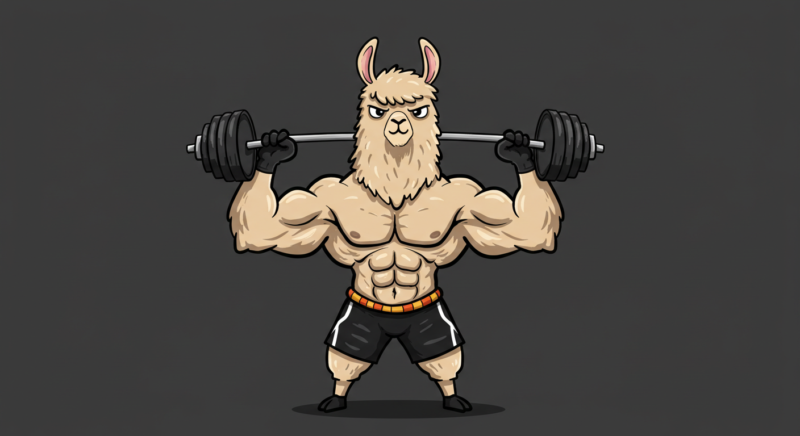

RLlama: Composable Reward Engineering Framework

  
 
 <em>A composable reward engineering framework for reinforcement learning.</em> 

Overview
RLlama is a specialized Python framework designed to solve one of the most challenging problems in reinforcement learning: reward engineering. It provides a structured approach to creating, combining, and optimizing reward functions, making your RL systems more effective and easier to understand.

Key Problems RLlama Solves
Reward Function Complexity: RL systems often need to balance multiple objectives, which leads to complex reward functions that are hard to design, debug, and maintain.

Reward Hacking: Poorly designed reward functions can lead to unintended agent behaviors as the agent finds loopholes to maximize rewards.

Reward Sparsity: Many real-world problems have sparse rewards, making learning difficult for agents.

Transparency: Understanding why an agent received a particular reward is often difficult with monolithic reward functions.

Tuning Difficulty: Adjusting reward functions through trial and error is time-consuming and inefficient.

Core Features
🧩 Modular Reward Components: Mix and match reward functions to shape agent behavior
🔍 Reward Optimization: Automatically tune reward weights with Bayesian optimization
🧠 Memory Systems: Episodic and working memory for improved agent capabilities
📊 Visualization Tools: Track and analyze reward contributions
🔗 RL Library Integration: Seamless integration with OpenAI Gym and Stable Baselines3
💬 RLHF Support: Tools for Reinforcement Learning from Human Feedback
🌐 Neural Network Reward Models: Deep learning based reward modeling
🎛️ Reward Normalization: Multiple strategies for normalizing rewards
Example
Python
from rllama import RewardEngine
from rllama.rewards.components import LengthReward, DiversityReward, CuriosityReward

# Create a reward engine
engine = RewardEngine()

# Add reward components
engine.add_component(LengthReward(target_length=100, strength=0.5))
engine.add_component(DiversityReward(history_size=10, strength=1.0))
engine.add_component(CuriosityReward(novelty_threshold=0.3))

# Set component weights
engine.set_weights({
    "LengthReward": 0.3,
    "DiversityReward": 0.5,
    "CuriosityReward": 0.2
})

# Compute rewards
context = {
    "response": "This is a test response", 
    "history": ["Previous response 1", "Previous response 2"],
    "state": current_state
}
reward = engine.compute(context)
print(f"Total reward: {reward}")
print(f"Component contributions: {engine.get_last_contributions()}")
Get Started
Ready to transform how you design reward functions?

Learn why RLlama is needed
See what RL is like without RLlama
See what RL is like with RLlama
Installation guide
Quickstart tutorial 
